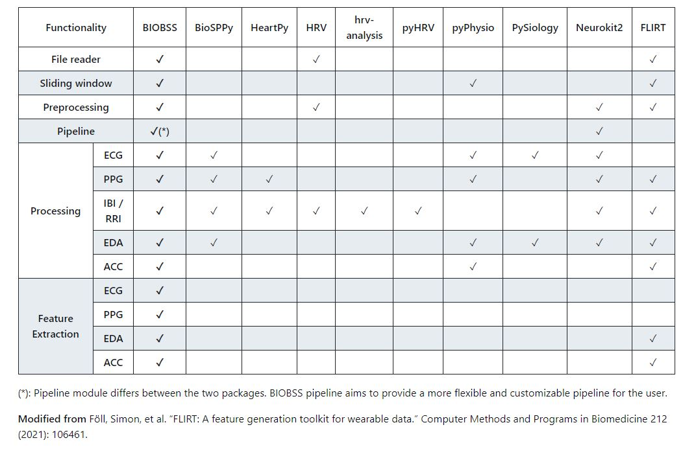

.. biobss documentation master file, created by
   sphinx-quickstart on Wed Nov 23 15:51:43 2022.
   You can adapt this file completely to your liking, but it should at least
   contain the root `toctree` directive.

Welcome to BIOBSS's documentation!
==================================

BIOBSS is a Python package for processing signals recorded using wearable sensors, such as Electrocardiogram (ECG), Photoplethysmogram (PPG), Electrodermal activity (EDA) and 3-axis acceleration (ACC).

BIOBSS's main focus is to generate end-to-end pipelines by adding required processes from BIOBSS or other Python packages. Some preprocessing methods were not implemented from scratch but imported from the existing packages.

Main features:

Applying basic preprocessing steps (*)
- Assessing quality of PPG and ECG signals

- Extracting features for ECG, PPG, EDA and ACC signals

- Performing Heart Rate Variability (HRV) analysis using PPG or ECG signals

- Extracting respiratory signals from PPG or ECG signals and estimating respiratory rate (*)

- Calculating activity indices from ACC signals

- Generating and saving pipelines

(*): Not all methods were implemented from scratch but imported from existing packages.

The table shows the capabilites of BIOBSS and the other Python packages for physiological signal processing.

   
**Preprocessing**

BIOBSS has modules with basic signal preprocessing functionalities. These include:

- Resampling

- Segmentation

- Normalization

- Filtering (basic filtering functions with commonly used filter parameters for each signal type)

- Peak detection

**Visualization**

BIOBSS has basic plotting modules specific to each signal type. Using the modules, the signals and peaks can be plotted using Matplotlib or Plotly packages.

**Signal Quality Assessment**

Signal quality assessment steps listed below can be used with PPG and ECG signals.

- Clipping detection

- Flatline detection

- Physiological checks

- Morphological checks

- Template matching

**Feature Extraction**

.. image:: images/features.JPG

**Heart Rate Variability Analysis**

Heart rate variability analysis can be performed with BIOBSS and the parameters given below can be calculated for PPG or ECG signals.

.. image:: images/hrv_parameters.JPG

**Activity Indices**

BIOBSS has functionality to calculate activity indices from 3-axis acceleration signals. These indices are:

- Proportional Integration Method (PIM)

- Zero Crossing Method (ZCM)

- Time Above Threshold (TAT)

- Mean Amplitude Deviation (MAD)

- Euclidian Norm Minus One (ENMO)

- High-pass Filtered Euclidian (HFEN)

- Activity Index (AI)

**Reference:** https://journals.plos.org/plosone/article?id=10.1371/journal.pone.0261718

The preprocessing steps which should be applied on the raw acceleration differs for each of the activity indices listed above. In other words, each activity index can be calculated only from specific datasets. These datasets can be generated using BIOBSS both independently or as a part of activity index calculation pipeline.

The generated datasets are:

- UFXYZ: unfiltered acc signals

- UFM: magnitude of unfiltered acc signals

- UFM_modified: modified magnitude of unfiltered signals (absolute(UFM-length(UFM)))

- UFNM: normalized magnitude of unfiltered acc signals

- FXYZ: filtered acc signals

- FXYZ_modified: modified filtered acc signals (absolute(FXYZ))

- FMpre: magnitude of filtered acc signals

- SpecialXYZ: filtered acc signals (special filter parameters)

- SpecialM: magnitude of filtered acc signals (special filter parameters)

- FMpost: filtered magnitude of acc signals

- FMpost_modified: modified of filtered magnitude of acc signals (absolute(FMpost))

**Respiratory Analysis**

BIOBSS has modules to perform basic respiratory analyses. The functionalities are:

- Preprocessing PPG or ECG signals for respiratory analysis using predefined filter parameters

- Extracting respiratory signals from modulations (amplitude modulation, frequency modulation, baseline wander) in PPG or ECG signals

- Estimating respiratory rate from the extracted respiratory signals

- Calculation respiratory quality indices (RQI)

- Fusing respiratory rate estimates

- Pipeline Generation

The main focus of BIOBSS is to generate and save pipelines for signal processing and feature extraction problems. Thus, it is aimed to :

- Simplify the preprocessing procedures by generating signal and event channels

- Make it easy to use processes

- Decrease the amount of work for repetitive processes and for those who work on multiple datasets

- Make it possible to save and share pipelines to compare results of different works

.. toctree::
   :maxdepth: 2
   :caption: Index:
   
   installation
   api
   examples
   development

Indices and tables
==================

* :ref:`genindex`
* :ref:`modindex`
* :ref:`search`
